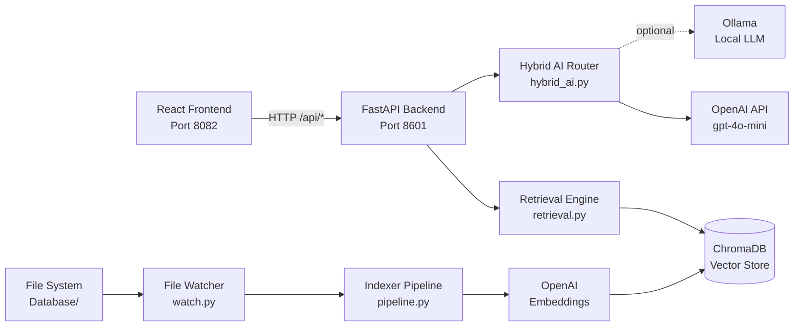
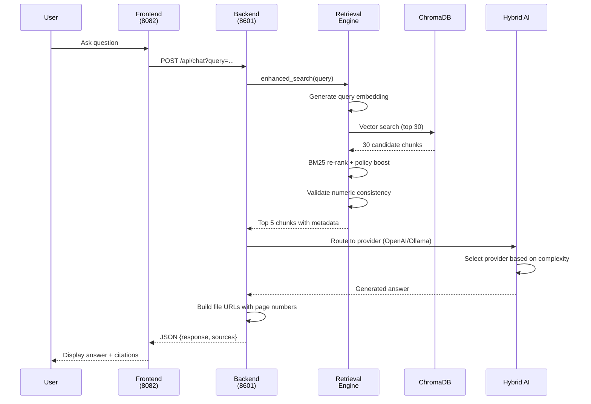
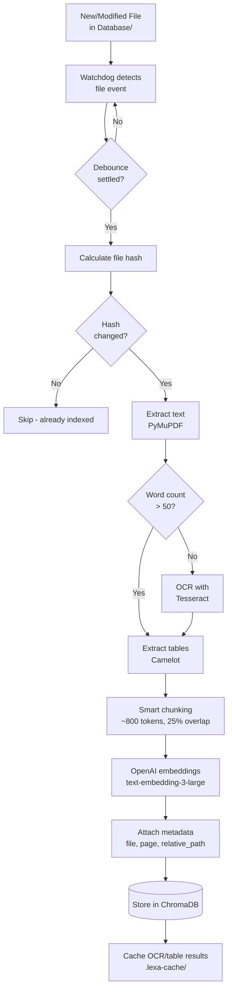

# Lexa AI V2 — Architecture

## Overview

Lexa AI V2 is a production-ready RAG (Retrieval-Augmented Generation) system built with FastAPI backend and React frontend. It uses ChromaDB for vector storage, combines semantic and lexical search (BM25), and supports hybrid AI routing between OpenAI (primary) and Ollama (optional local).

**Key Features:**
- Hybrid search: Vector similarity + BM25 re-ranking
- Multi-provider AI: OpenAI primary, Ollama fallback
- Intelligent document processing with OCR and table extraction
- Real-time file watching and auto-indexing
- Page-accurate source citations
- Admin branding customization

---

## Components

### Frontend (Port 8082)
- **Technology:** React 19 + TypeScript + Vite
- **Location:** `frontend/src/`
- **Key Pages:**
  - `ClientChat.tsx` - Main chat interface
  - `AdminBranding.tsx` - Branding configuration panel
  - `AdminLogin.tsx` - Admin authentication
- **API Client:** `lib/api.ts`

### Backend (Port 8601)
- **Technology:** FastAPI + Python 3.12+
- **Entry Point:** `backend/app.py` (282 lines, clean production version)
- **API Docs:** http://localhost:8601/api/docs

### Retrieval Engine
- **Module:** `lexa_app/retrieval.py`
- **Strategy:**
  1. Vector search (ChromaDB, top 30 results)
  2. BM25 re-ranking (lexical relevance, 40% weight)
  3. Policy boost (1.2x for handbooks/policies)
  4. Numeric consistency validation
  5. Return top 5 chunks with metadata

### Hybrid AI Router
- **Module:** `lexa_app/hybrid_ai.py`
- **Providers:**
  - **OpenAI** (primary) - `lexa_app/providers/openai_provider.py`
  - **Ollama** (optional) - `lexa_app/providers/ollama_client.py`
- **Routing Logic:** Prefer local (Ollama) for simple queries, fallback to OpenAI for complex or on failure

### Document Indexer
- **Pipeline:** `indexer/pipeline.py`
- **Watcher:** `indexer/watch.py`
- **Process:** Extract → Chunk → Embed → Store
- **Cache:** `backend/Database/.lexa-cache/`

### Vector Store
- **Database:** ChromaDB (SQLite-based)
- **Location:** `backend/chroma_db/`
- **Collection:** `lexa_documents`
- **Embedding Model:** OpenAI `text-embedding-3-large` (1536 dimensions)
- **Distance Metric:** Cosine similarity

---

## High-Level Architecture



---

## Data Flows

### Query Flow



### Document Ingestion Flow



---

## Active Modules & Responsibilities

### Core Application (`backend/app.py`)
- FastAPI app initialization
- CORS and session middleware
- Admin authentication (session tokens)
- Health check endpoints
- Main chat endpoint (`/api/chat`)
- Public branding endpoint

### Retrieval System

**`lexa_app/retrieval.py`** (EnhancedRetriever class)
- Vector search via ChromaDB
- BM25 re-ranking (40% weight)
- Policy keyword boost (1.2x multiplier)
- Numeric consistency validation
- Source deduplication

**`lexa_app/query_rewrite.py`**
- Query expansion with synonyms
- Intent classification
- Abbreviation expansion

**`lexa_app/answer_validator.py`**
- Answer quality validation
- Confidence scoring
- Hallucination detection

### Hybrid AI System

**`lexa_app/hybrid_ai.py`** (HybridAIService)
- Initialize and manage AI providers
- Configuration from environment
- Graceful fallback handling

**`lexa_app/hybrid_endpoints.py`**
- API routes for `/api/hybrid/*`
- Provider status and health

**`lexa_app/providers/`**
- `base_provider.py` - Abstract provider interface
- `openai_provider.py` - OpenAI integration
- `ollama_client.py` - Ollama local LLM integration
- `hybrid_router.py` - Multi-provider routing logic
- `enhanced_retrieval.py` - Advanced retrieval strategies

### Document Indexing Pipeline

**`indexer/pipeline.py`** (DocumentPipeline class)
- Hash-based change detection
- Multi-format text extraction (PDF, DOCX, TXT, MD, etc.)
- OCR fallback for image-heavy PDFs
- Table extraction with Camelot
- Smart chunking with section awareness
- OpenAI embedding generation
- ChromaDB storage with metadata

**`indexer/watch.py`**
- File system monitoring (watchdog)
- Event debouncing
- Automatic reindexing on changes

**`indexer/chunk.py`**
- Section-aware chunking
- Token counting with tiktoken
- Configurable overlap (25%)

**`indexer/cache.py`**
- OCR result caching
- Table extraction caching
- Hash-based cache invalidation

**`indexer/store.py`**
- ChromaDB client management
- Collection operations
- Metadata schema

### Settings & Configuration

**`settings_store.py`**
- Persistent settings management
- Branding configuration storage
- JSON-based storage in `backend/storage/`

---

## Configuration Surface

### Environment Variables

| Variable | Default | Description |
|----------|---------|-------------|
| `OPENAI_API_KEY` | *required* | OpenAI API key for embeddings and LLM |
| `ADMIN_PASSWORD` | `Krypt0n!t3` | Admin panel password |
| `SECRET_KEY` | `your-secret-key-change-me` | Session signing key |
| `PUBLIC_HOST` | *(empty)* | Public-facing hostname for file URLs |
| `LEXA_CHUNK_TOKENS` | `800` | Target tokens per chunk |
| `LEXA_EMBED_MODEL` | `text-embedding-3-large` | OpenAI embedding model |
| `LEXA_WATCH_DIR` | `Database/` | Directory to monitor for documents |
| `LEXA_OCR_WORD_THRESHOLD` | `50` | Min words before OCR activation |
| `LEXA_DISABLE_OCR` | *(unset)* | Set to disable OCR |
| `LEXA_DISABLE_TABLES` | *(unset)* | Set to disable table extraction |
| `LEXA_SKIP_IMAGE_ONLY` | *(unset)* | Set to skip image-only PDFs |

### Files Written/Read

**Configuration:**
- `backend/storage/settings.json` - Branding and app settings
- `backend/.env` - Environment variables (optional, not in repo)

**Data Storage:**
- `backend/chroma_db/` - ChromaDB vector database
- `backend/Database/.lexa-cache/` - OCR and table extraction cache
- `backend/data/faq_cache.json` - FAQ caching
- `backend/document_ids.json` - Document ID mapping

**Logs:**
- Application logs to stdout/stderr
- Systemd journals (production)

---

## Security Notes

### Authentication & Sessions
- **Admin authentication:** Password-based (configurable via `ADMIN_PASSWORD`)
- **Session tokens:** Signed with `SECRET_KEY` using itsdangerous
- **Session cookie:**
  - Name: `lexa_session`
  - Max age: 24 hours (86400 seconds)
  - HTTPOnly: Yes (prevents XSS)
  - Secure: Yes (HTTPS only)
  - SameSite: None (for Cloudflare Access)
  - Domain: `.bizbots24.com`

### CORS Configuration
```python
# Allowed origins
- https://lexaai.bizbots24.com
- https://bizbots24.cloudflareaccess.com
- http://localhost:8081
- http://localhost:5173

# Regex pattern for subdomains
allow_origin_regex = r"^https://([a-z0-9-]+\.)*bizbots24\.com$"
```

### Secrets Management
- **Never commit:** `.env` files, API keys, passwords
- **Use environment variables** for sensitive configuration
- **Rotate secrets regularly:** Especially `SECRET_KEY` and `ADMIN_PASSWORD`
- **API keys:** Store in environment, not in code

### Trusted Hosts
- Configured via `TrustedHostMiddleware`
- Allows all hosts (development mode)
- **Production:** Should restrict to specific domains

---

## Module Dependencies

### Core Dependencies (Required)
- `fastapi`, `uvicorn` - Web framework
- `openai` - Embeddings and LLM (CRITICAL)
- `chromadb` - Vector database (CRITICAL)
- `rank-bm25` - BM25 re-ranking (CRITICAL)
- `pymupdf` - PDF processing
- `pytesseract`, `pdf2image` - OCR
- `camelot-py[cv]` - Table extraction
- `watchdog` - File monitoring
- `tiktoken` - Token counting
- `python-dotenv` - Environment loading
- `passlib`, `bcrypt` - Password hashing
- `itsdangerous` - Session signing

### Removed Dependencies (as of cleanup)
- ❌ `langchain`, `langchain-openai` - Only used in archived files
- ❌ `pdfminer.six` - Not imported, PyMuPDF used instead

---

## Performance Characteristics

### Retrieval Latency
- **Vector search:** ~50-200ms (depends on collection size)
- **BM25 re-ranking:** ~10-50ms (30 candidates)
- **Total retrieval:** ~100-300ms

### Indexing Throughput
- **PDF extraction:** ~1-5 seconds per document (with OCR)
- **Chunking:** ~100-500ms per document
- **Embedding generation:** ~1-2 seconds per batch (OpenAI API)
- **ChromaDB insertion:** ~50-200ms

### Resource Usage
- **Memory:** ~500MB-2GB (depends on ChromaDB size)
- **CPU:** Low during idle, high during OCR
- **Disk:** ~100MB base + vector DB size

---

## Scaling Considerations

### Current Limitations (VM Setup)
- Single-threaded indexing pipeline
- No GPU acceleration (CPU-only OCR)
- Local ChromaDB (not distributed)

### Future Enhancements for Desktop AI
- **Ollama integration:** Already supported, just needs local Ollama installation
- **GPU acceleration:** Can leverage local GPU for embeddings via Ollama
- **Faster OCR:** Could use GPU-accelerated tesseract or alternatives
- **Larger models:** Desktop can run larger local LLMs (70B+)

### Migration Path to Powerful Desktop
1. Install Ollama on desktop
2. Pull desired model: `ollama pull llama3:70b`
3. Configure environment:
   ```bash
   export LEXA_ENABLE_OLLAMA=true
   export LEXA_OLLAMA_BASE_URL=http://desktop-ip:11434
   export LEXA_OLLAMA_MODEL=llama3:70b
   ```
4. Hybrid router will automatically prefer local model
5. OpenAI remains as fallback for complex queries

---

## Project Structure

```
Lexa_AI_V2/
├── backend/
│   ├── app.py                    # Main FastAPI application ⭐
│   ├── requirements.txt          # Python dependencies
│   ├── settings_store.py         # Settings persistence
│   ├── lexa_app/                 # Core application modules
│   │   ├── hybrid_ai.py          # Hybrid AI service ⭐
│   │   ├── hybrid_endpoints.py   # API endpoints ⭐
│   │   ├── retrieval.py          # Enhanced retrieval ⭐
│   │   ├── query_rewrite.py      # Query expansion
│   │   ├── answer_validator.py   # Answer validation
│   │   ├── providers/            # AI provider implementations
│   │   │   ├── base_provider.py
│   │   │   ├── openai_provider.py
│   │   │   ├── ollama_client.py
│   │   │   └── hybrid_router.py
│   │   └── ingest/               # Document ingestion
│   │       └── smart_chunker.py
│   ├── indexer/                  # Document indexing pipeline
│   │   ├── pipeline.py           # Main pipeline ⭐
│   │   ├── watch.py              # File watcher ⭐
│   │   ├── chunk.py              # Chunking logic
│   │   ├── cache.py              # Caching layer
│   │   ├── store.py              # ChromaDB interface
│   │   ├── ocr.py                # OCR processing
│   │   └── tables.py             # Table extraction
│   ├── utils/                    # Utilities
│   │   └── prompt.py             # Prompt templates
│   ├── tests/                    # Unit tests
│   │   ├── test_query_rewrite.py
│   │   └── test_answer_validator.py
│   ├── storage/                  # Persistent storage
│   │   └── settings.json         # App settings
│   ├── Database/                 # Document source directory
│   │   └── .lexa-cache/          # Processing cache
│   └── chroma_db/                # Vector database
├── frontend/
│   ├── src/
│   │   ├── main.tsx              # React entry point
│   │   ├── App.tsx               # Main component
│   │   ├── pages/                # Page components
│   │   │   ├── ClientChat.tsx    # Chat interface ⭐
│   │   │   ├── AdminBranding.tsx # Admin panel ⭐
│   │   │   └── AdminLogin.tsx    # Auth page
│   │   └── lib/                  # Frontend utilities
│   │       ├── api.ts            # API client
│   │       └── theme.ts          # Theming
│   ├── package.json              # Node dependencies
│   └── vite.config.ts            # Vite configuration
├── deployment/                   # Production deployment
│   ├── lexa-backend.service      # Systemd service
│   └── ai-bridge-watcher.service # Watcher service
├── docs/                         # Documentation
│   └── ARCHITECTURE.md           # This file
├── archive/                      # Archived old code
│   └── audit_20251022/           # Cleanup archive
├── .venv/                        # Python virtual environment
└── README.md                     # Quick start guide
```

**⭐ = Critical active modules**

---

## Revision History

- **2025-10-22:** Audit cleanup - removed langchain dependencies, archived obsolete files
- **2025-10-15:** Added Cloudflare Access CORS support
- **2025-09-03:** Finalized branding system
- **2025-08-31:** Frontend cleanup and purge
