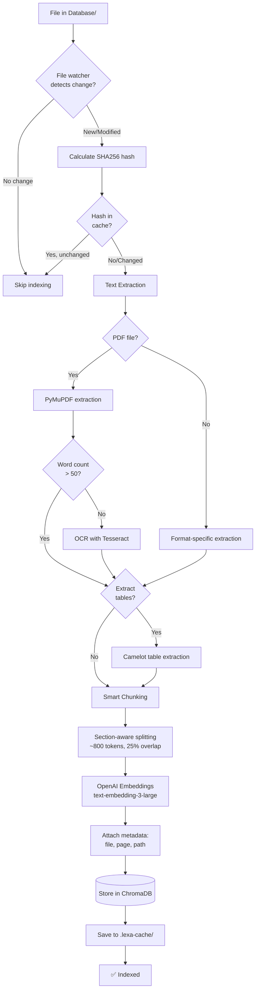
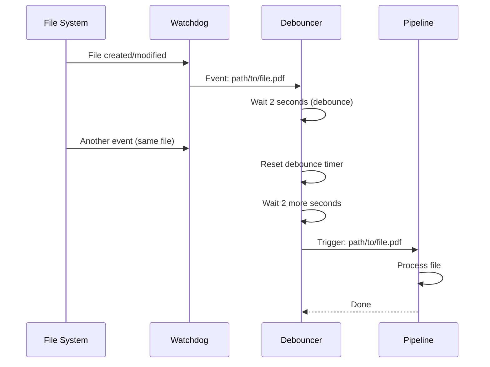

# Lexa AI V2 — Document Indexing Pipeline

Complete guide to the document ingestion, processing, and indexing system.

---

## Table of Contents

1. [Overview](#overview)
2. [Supported File Formats](#supported-file-formats)
3. [Pipeline Architecture](#pipeline-architecture)
4. [Text Extraction](#text-extraction)
5. [Smart Chunking](#smart-chunking)
6. [Embedding Generation](#embedding-generation)
7. [Metadata Schema](#metadata-schema)
8. [File Watcher](#file-watcher)
9. [Caching System](#caching-system)
10. [Reindexing](#reindexing)
11. [Troubleshooting](#troubleshooting)

---

## Overview

The indexing pipeline converts documents into searchable vector embeddings stored in ChromaDB. It uses a multi-stage process:

1. **Detection:** File watcher monitors `Database/` directory
2. **Extraction:** PyMuPDF extracts text, with OCR fallback
3. **Tables:** Camelot extracts table data
4. **Chunking:** Smart chunking (~800 tokens, 25% overlap)
5. **Embedding:** OpenAI generates embeddings
6. **Storage:** ChromaDB stores vectors with metadata
7. **Caching:** Results cached to avoid reprocessing

**Key Modules:**
- `indexer/pipeline.py` - Main processing pipeline
- `indexer/watch.py` - File system monitoring
- `indexer/chunk.py` - Section-aware chunking
- `indexer/cache.py` - Cache management
- `indexer/ocr.py` - OCR processing
- `indexer/tables.py` - Table extraction
- `indexer/store.py` - ChromaDB interface

---

## Supported File Formats

### Fully Supported (Text + Tables)

| Format | Extension | Extraction Tool | OCR Support | Table Support |
|--------|-----------|----------------|-------------|---------------|
| PDF | `.pdf` | PyMuPDF (fitz) | ✅ Tesseract | ✅ Camelot |
| Word | `.docx` | python-docx | ❌ | ❌ |
| Text | `.txt` | Built-in | ❌ | ❌ |
| Markdown | `.md` | Built-in | ❌ | ❌ |

### Partially Supported (Text Only)

| Format | Extension | Extraction Tool | Notes |
|--------|-----------|----------------|-------|
| PowerPoint | `.pptx` | python-pptx | Text extraction only, no images |
| Excel | `.xlsx` | openpyxl | Cell values as text |
| CSV | `.csv` | Built-in CSV | Plain text parsing |
| RTF | `.rtf` | striprtf | Basic text extraction |

### Not Supported

- Images (`.jpg`, `.png`, `.gif`) - No standalone image indexing
- Videos (`.mp4`, `.avi`) - No video processing
- Audio (`.mp3`, `.wav`) - No audio transcription
- Archives (`.zip`, `.tar.gz`) - Must extract manually first

**Note:** Image-heavy PDFs are supported via OCR.

---

## Pipeline Architecture



---

## Text Extraction

### PDF Processing (Primary Format)

**Tool:** PyMuPDF (fitz)

**Process:**
1. Open PDF with PyMuPDF
2. Extract text page by page
3. Count words in extracted text
4. If word count < 50, trigger OCR
5. Combine text and OCR results

**Example:**
```python
import fitz  # PyMuPDF

doc = fitz.open("document.pdf")
for page_num in range(len(doc)):
    page = doc[page_num]
    text = page.get_text()

    # Word count check
    word_count = len(text.split())
    if word_count < 50:
        # Trigger OCR
        pix = page.get_pixmap()
        ocr_text = pytesseract.image_to_string(pix)
        text = ocr_text
```

**Configuration:**
- `LEXA_OCR_WORD_THRESHOLD` - Minimum words before OCR (default: 50)
- `LEXA_DISABLE_OCR` - Set to `1` to disable OCR entirely

### OCR Fallback

**Tool:** Tesseract OCR via pytesseract

**When triggered:**
- PDF page has < 50 words of extractable text
- Likely image-based or scanned PDF

**Process:**
1. Convert PDF page to image (PIL/Pillow)
2. Pass image to Tesseract
3. Tesseract extracts text via OCR
4. Cache OCR result to avoid reprocessing

**Performance:**
- **Speed:** ~2-5 seconds per page (CPU-dependent)
- **Accuracy:** 85-95% for clean scans, lower for poor quality

**Cache location:** `backend/Database/.lexa-cache/{file_hash}/page-{num}.ocr.txt`

**Disabling OCR:**
```bash
export LEXA_DISABLE_OCR=1
# OCR will be skipped, only direct text extraction used
```

### DOCX Processing

**Tool:** python-docx

**Process:**
1. Open DOCX file
2. Extract paragraphs and runs
3. Preserve formatting markers (headings, lists)
4. Combine into plain text

**Limitations:**
- No table extraction (yet)
- No image extraction
- Headers/footers included

### Other Formats

**Text/Markdown (.txt, .md):**
- Direct file read with UTF-8 encoding
- No special processing

**PowerPoint (.pptx):**
- Extract text from slides
- Slide notes included
- Images and charts ignored

**Excel (.xlsx):**
- Extract cell values
- Sheet names preserved in metadata
- Formulas show results, not formulas

**CSV:**
- Plain text parsing
- Header row detected automatically

**RTF:**
- Uses `striprtf` library
- Basic text extraction only

---

## Smart Chunking

### Chunking Strategy

**Goal:** Create semantically coherent chunks of ~800 tokens with overlap for context.

**Parameters:**
- **Target size:** 800 tokens (configurable via `LEXA_CHUNK_TOKENS`)
- **Overlap:** 25% (~200 tokens)
- **Token counter:** tiktoken (OpenAI's tokenizer)

**Why 800 tokens?**
- Fits comfortably within embedding model limits (8191 tokens)
- Large enough for context, small enough for precision
- Balances retrieval quality and index size

### Section-Aware Chunking

The chunker tries to respect document structure:

**Preserved boundaries:**
- Paragraph breaks
- Heading boundaries
- List items
- Table boundaries

**Process:**
1. Split document by double newlines (paragraphs)
2. Count tokens in each paragraph
3. Combine paragraphs until ~800 tokens
4. Add 25% overlap from previous chunk
5. Ensure no chunk exceeds 1200 tokens (hard limit)

**Example:**
```
Document: 3000 tokens total
Chunks:
  1. Tokens 0-800 (intro + section 1)
  2. Tokens 600-1400 (overlap 200, section 1 + section 2)
  3. Tokens 1200-2000 (overlap 200, section 2 + section 3)
  4. Tokens 1800-2600 (overlap 200, section 3)
  5. Tokens 2400-3000 (overlap 200, section 4)
```

### Overlap Rationale

**Why overlap?**
- Prevents information split across chunk boundaries
- Improves retrieval of context-dependent information
- Handles questions that need context from adjacent sections

**Example:** Question about "PTO accrual after 5 years"
- Answer might span two chunks
- Overlap ensures both chunks contain full context

### Chunking Code Location

**File:** `indexer/chunk.py`

**Key function:**
```python
def chunk_text(text: str, max_tokens: int = 800, overlap_pct: float = 0.25) -> List[str]:
    """
    Split text into overlapping chunks.

    Args:
        text: Input text to chunk
        max_tokens: Target tokens per chunk
        overlap_pct: Overlap percentage (0.25 = 25%)

    Returns:
        List of text chunks
    """
```

---

## Embedding Generation

### Embedding Model

**Default:** OpenAI `text-embedding-3-large`
- **Dimensions:** 1536
- **Context window:** 8191 tokens
- **Cost:** $0.13 per 1M tokens (as of 2024)

**Alternative:** `text-embedding-3-small`
- **Dimensions:** 512
- **Context window:** 8191 tokens
- **Cost:** $0.02 per 1M tokens
- **Trade-off:** Lower cost, slightly lower quality

**Configuration:**
```bash
# Use larger model (default, better quality)
export LEXA_EMBED_MODEL=text-embedding-3-large

# Or use smaller model (cheaper, faster)
export LEXA_EMBED_MODEL=text-embedding-3-small
```

### Embedding Process

```python
import openai

client = openai.OpenAI()

# Generate embeddings for chunks
response = client.embeddings.create(
    model="text-embedding-3-large",
    input=chunks  # List of text chunks
)

# Extract embeddings
embeddings = [item.embedding for item in response.data]
```

**Batching:**
- Chunks processed in batches for efficiency
- Batch size: Up to 100 chunks per API call
- Rate limiting: Respects OpenAI rate limits

**Error handling:**
- Retries on transient failures (3 attempts)
- Falls back to individual chunk processing on batch failure
- Logs failures for manual review

---

## Metadata Schema

Each chunk stored in ChromaDB includes metadata for tracking and retrieval.

### Metadata Fields

| Field | Type | Description | Example |
|-------|------|-------------|---------|
| `file_name` | string | Base filename | `"employee-handbook.pdf"` |
| `relative_path` | string | Path relative to Database/ | `"HR/policies/employee-handbook.pdf"` |
| `page` | integer | Page number (PDF) or section | `15` |
| `chunk_index` | integer | Chunk number within document | `3` |
| `file_hash` | string | SHA256 hash of source file | `"a3f2..."` |
| `indexed_at` | string | ISO timestamp | `"2025-10-22T14:30:00Z"` |
| `total_chunks` | integer | Total chunks in document | `42` |
| `doc_type` | string | File extension | `"pdf"` |

### Example Metadata

```json
{
  "file_name": "employee-handbook.pdf",
  "relative_path": "HR/policies/employee-handbook.pdf",
  "page": 15,
  "chunk_index": 3,
  "file_hash": "a3f2c8d9e1b4f7a0c9d2e5f8b1a4c7d0e3f6a9b2c5d8e1f4a7b0c3d6e9f2a5",
  "indexed_at": "2025-10-22T14:30:00Z",
  "total_chunks": 42,
  "doc_type": "pdf"
}
```

### Metadata Usage

**In retrieval:**
- Filter by `doc_type` or `relative_path`
- Sort by relevance and `page` for sequential reading
- Display `file_name` and `page` in citations

**In caching:**
- `file_hash` used for cache key
- Invalidate cache when hash changes

**In debugging:**
- `indexed_at` shows when document was last processed
- `chunk_index` and `total_chunks` show coverage

---

## File Watcher

### Overview

**Module:** `indexer/watch.py`

**Purpose:** Monitor `Database/` directory for changes and trigger reindexing automatically.

**Technology:** Watchdog (Python file system events library)

### How It Works



### Debouncing

**Why debounce?**
- Prevents duplicate processing on rapid file saves
- Editors often save files multiple times per second
- Reduces unnecessary reindexing

**Debounce window:** 2 seconds (configurable)

**Example:**
```
0.0s: File modified → Start timer
0.5s: File modified again → Reset timer
1.2s: File modified again → Reset timer
3.2s: No more changes → Trigger indexing
```

### Events Monitored

| Event Type | Action |
|------------|--------|
| File created | Index new file |
| File modified | Reindex file (if hash changed) |
| File deleted | Remove from ChromaDB (future) |
| File moved | Reindex at new location |

### Running the Watcher

**Development:**
```bash
source .venv/bin/activate
cd backend
python -m indexer.watch
```

**Production (systemd):**
```bash
sudo systemctl start ai-bridge-watcher
sudo systemctl status ai-bridge-watcher
```

**Logs:**
```bash
# Development: stdout
# Production: journalctl
sudo journalctl -u ai-bridge-watcher -f
```

### Configuration

**Watch directory:**
```bash
export LEXA_WATCH_DIR=Database
# Watches: backend/Database/
```

**Disable watcher:**
- Just don't run it
- Files must be manually reindexed: `python -m indexer.reindex Database/`

---

## Caching System

### Cache Purpose

**Goal:** Avoid reprocessing expensive operations (OCR, table extraction).

**Cached operations:**
1. OCR results (Tesseract output)
2. Table extraction (Camelot output)
3. Document metadata

**Not cached:**
- Embeddings (too large, cheap to regenerate)
- Final ChromaDB storage (database itself is the cache)

### Cache Structure

**Location:** `backend/Database/.lexa-cache/`

**Directory structure:**
```
.lexa-cache/
├── {file_hash_1}/
│   ├── doc.meta.json          # Document metadata
│   ├── page-0001.ocr.txt      # OCR result for page 1
│   ├── page-0001.tables.json  # Table data for page 1
│   ├── page-0002.ocr.txt
│   └── page-0002.tables.json
├── {file_hash_2}/
│   └── ...
```

**File hash:** SHA256 of source file content

### Cache Invalidation

**When cache is invalidated:**
- File content changes (hash mismatch)
- Manual cache clear: `rm -rf backend/Database/.lexa-cache/`

**When cache is preserved:**
- File moved (content unchanged, hash stays same)
- File renamed (content unchanged)

### Cache Size Management

**Typical size:**
- OCR text: ~2-10 KB per page
- Table JSON: ~1-50 KB per page
- Total: ~10-100 MB for 1000 pages

**Cleanup:**
```bash
# Clear all cache
rm -rf backend/Database/.lexa-cache/

# Clear cache for specific file
rm -rf backend/Database/.lexa-cache/{file_hash}/

# Clear only OCR cache (keep tables)
find backend/Database/.lexa-cache/ -name "*.ocr.txt" -delete
```

**Automatic cleanup:** Not implemented (future feature)

### Cache Benefits

| Operation | Without Cache | With Cache | Speedup |
|-----------|---------------|------------|---------|
| OCR (10 pages) | 30-50 seconds | < 1 second | 50x |
| Table extraction | 10-20 seconds | < 1 second | 20x |
| Full reindex (100 docs) | 30-60 minutes | 5-10 minutes | 6x |

---

## Reindexing

### Manual Reindex

**Full reindex (all documents):**
```bash
source .venv/bin/activate
cd backend
python -m indexer.reindex Database/
```

**Reindex specific file:**
```bash
python -m indexer.reindex Database/path/to/file.pdf
```

**Reindex directory:**
```bash
python -m indexer.reindex Database/HR/
```

### Force Reindex (Ignore Cache)

```bash
# Clear cache first
rm -rf Database/.lexa-cache/

# Then reindex
python -m indexer.reindex Database/
```

### Reindex Options

**Module:** `indexer/reindex.py`

**Usage:**
```bash
python -m indexer.reindex [path] [options]

Options:
  --force       Force reindex even if hash matches
  --no-ocr      Skip OCR processing
  --no-tables   Skip table extraction
  --verbose     Show detailed progress
```

**Example:**
```bash
# Reindex with verbose output, skip OCR
python -m indexer.reindex Database/ --no-ocr --verbose
```

### Progress Monitoring

**Output:**
```
Indexing: Database/
Found 150 documents
[1/150] Processing employee-handbook.pdf (42 pages)...
  - Extracted text: 12,450 words
  - OCR triggered: 3 pages
  - Tables found: 5
  - Chunks created: 42
  - Embeddings generated: 42
  - Stored in ChromaDB
[2/150] Processing benefits-guide.pdf...
...
✅ Complete: 150 documents, 3,240 chunks indexed
```

### Reindex Performance

**Factors affecting speed:**
- Number of documents
- Document length
- OCR usage (slow)
- Table extraction (moderate)
- OpenAI API rate limits

**Typical speeds:**
- Simple text PDF (10 pages): 5-10 seconds
- Image-heavy PDF with OCR (10 pages): 30-60 seconds
- DOCX (20 pages): 3-5 seconds

**Parallelization:** Not currently supported (single-threaded)

---

## Troubleshooting

### Common Issues

#### 1. OCR Not Working

**Symptom:** Image-based PDFs return no text

**Diagnosis:**
```bash
# Test Tesseract installation
tesseract --version

# Test OCR manually
tesseract test_image.png output
cat output.txt
```

**Solutions:**
- Install Tesseract: `sudo apt-get install tesseract-ocr`
- Install language data: `sudo apt-get install tesseract-ocr-eng`
- Check `LEXA_DISABLE_OCR` is not set

#### 2. Table Extraction Fails

**Symptom:** Tables not extracted from PDFs

**Diagnosis:**
```bash
# Test Ghostscript installation
gs --version

# Check for Camelot errors in logs
python -m indexer.reindex test.pdf --verbose
```

**Solutions:**
- Install Ghostscript: `sudo apt-get install ghostscript`
- Install poppler: `sudo apt-get install poppler-utils`
- Check PDF isn't encrypted/password-protected

#### 3. Embedding Generation Fails

**Symptom:** "OpenAI API error" during indexing

**Diagnosis:**
```bash
# Test API key
python -c "import openai; client = openai.OpenAI(); print(client.models.list())"
```

**Solutions:**
- Verify `OPENAI_API_KEY` is set correctly
- Check API key has credits/quota
- Check network connectivity to api.openai.com
- Review OpenAI API status page

#### 4. File Not Being Indexed

**Symptom:** New file in Database/ not appearing in search

**Diagnosis:**
```bash
# Check if file is in ChromaDB
python -c "
import chromadb
client = chromadb.PersistentClient(path='backend/chroma_db')
collection = client.get_collection('lexa_documents')
results = collection.get(where={'file_name': 'yourfile.pdf'})
print(f'Found {len(results[\"ids\"])} chunks')
"
```

**Solutions:**
- Manually reindex: `python -m indexer.reindex Database/yourfile.pdf`
- Check file watcher is running
- Check file is in supported format
- Check file isn't corrupted

#### 5. Slow Indexing

**Symptom:** Indexing takes hours

**Causes:**
- Many large PDFs
- Excessive OCR usage
- OpenAI API rate limiting

**Solutions:**
- Disable OCR for text-based PDFs: `export LEXA_DISABLE_OCR=1`
- Disable table extraction: `export LEXA_DISABLE_TABLES=1`
- Use smaller embedding model: `export LEXA_EMBED_MODEL=text-embedding-3-small`
- Index in batches overnight

#### 6. Cache Not Working

**Symptom:** Files reprocessed every time despite no changes

**Diagnosis:**
```bash
# Check cache directory exists
ls -la backend/Database/.lexa-cache/

# Check file hash
python -c "
import hashlib
with open('Database/yourfile.pdf', 'rb') as f:
    print(hashlib.sha256(f.read()).hexdigest())
"
```

**Solutions:**
- Ensure `.lexa-cache/` directory has write permissions
- Check file hasn't been modified (hash changed)
- Verify cache isn't being cleared automatically

---

## Performance Tuning

### Optimizing Indexing Speed

**1. Disable unnecessary features:**
```bash
export LEXA_DISABLE_OCR=1        # If PDFs are text-based
export LEXA_DISABLE_TABLES=1     # If tables aren't needed
export LEXA_SKIP_IMAGE_ONLY=1    # Skip image-only PDFs
```

**2. Use smaller embedding model:**
```bash
export LEXA_EMBED_MODEL=text-embedding-3-small  # 10x cheaper, slightly lower quality
```

**3. Adjust chunk size:**
```bash
export LEXA_CHUNK_TOKENS=1000  # Larger chunks = fewer embeddings = faster
```

**4. Batch processing:**
```bash
# Index in smaller batches
python -m indexer.reindex Database/batch1/
python -m indexer.reindex Database/batch2/
```

### Optimizing Retrieval Quality

**1. Use larger embedding model:**
```bash
export LEXA_EMBED_MODEL=text-embedding-3-large  # Better quality (default)
```

**2. Smaller chunks for precision:**
```bash
export LEXA_CHUNK_TOKENS=600  # Smaller chunks = more precise but more embeddings
```

**3. Enable all features:**
```bash
# Ensure OCR and tables are enabled
unset LEXA_DISABLE_OCR
unset LEXA_DISABLE_TABLES
```

---

## Best Practices

### Document Preparation

**Before indexing:**
1. Remove password protection from PDFs
2. Ensure scanned PDFs are decent quality (300+ DPI)
3. Convert images to PDFs for OCR processing
4. Organize files in logical directory structure
5. Use descriptive filenames

### Indexing Strategy

**Initial indexing:**
1. Start with small sample (10-20 documents)
2. Test retrieval quality
3. Adjust chunk size/OCR settings if needed
4. Index full document set
5. Monitor for errors

**Ongoing indexing:**
1. Let file watcher handle new/modified files automatically
2. Periodically check ChromaDB document count
3. Reindex from scratch quarterly to clean up

### Maintenance

**Weekly:**
- Check ChromaDB size: `du -sh backend/chroma_db/`
- Check cache size: `du -sh backend/Database/.lexa-cache/`

**Monthly:**
- Review indexing logs for errors
- Test sample queries for quality
- Update dependencies if needed

**Quarterly:**
- Full reindex from scratch
- Clear cache: `rm -rf backend/Database/.lexa-cache/`
- Backup ChromaDB before reindex

---

## See Also

- [ARCHITECTURE.md](./ARCHITECTURE.md) - System architecture overview
- [RUNBOOK.md](./RUNBOOK.md) - Operational procedures
- [TROUBLESHOOTING.md](./TROUBLESHOOTING.md) - Common issues and fixes
- [API.md](../API.md) - API endpoint reference
